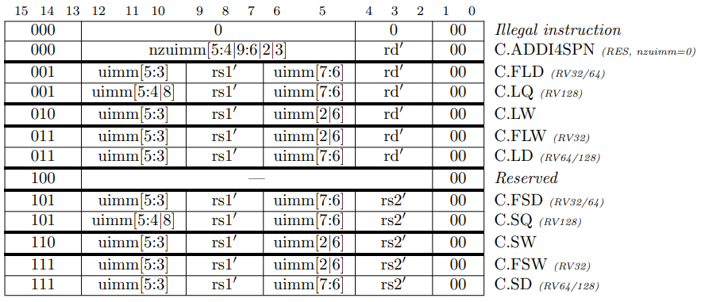

# **AQL Tech Solutions, Islamabad - Pakistan**

## **Project Report** 
### *Compressed Extension of RISCV Core*
___

## **Group Members**
### Soban Ahmed
### Ariba Zahid
### Nadeem Asghar
___
## **Project Owners**
### Aamir Sultan
### Haseeb Ahmed 
---

### **Dated: 10th June, 2022**
---

# **Compressed Extension of RISCV Core**
## **Introduction**

The RISCV Instruction Set Architecture (ISA) is becoming an increasingly popular ecosystem for both hardware and software development. Over the last few years, the RISC-V Instruction Set Architecture (ISA) has established itself as a completely free, open-source, widely supported, and well-documented software/hardware ecosystem that is ideal for both hardware implementation and software creation. In this project we will design and verify the RISCV's most versatile ISA extensions, which allows for compressed 16-bit instructions to coexist with regular 32-bit instructions. Compressed instructions are a set of instructions which has length 16 bit with respect to RISC-V architecture. The Compressed instruction are represented by the character "C" in RISC-V specifications. So, in this project design and verification of compressed extension of RISCV Core would done. For design and verification of compressed extension of RISCV core firstly related literature is reviewed. Then we have distributed our tasks and start working on tasks. Following is the details of our task distribution.

| Group Member | Tasks |
|:---------:|:---------:|
|Soban Ahmed | RTL Flow/ Embedded Decoder in RTL|
|Ariba Zahid | RTL Test Flow/ Trace log/Coverage/ Assembly Tests/ Git Ignore |
|Nadeem Asghar |Compressed Decoder/ Block Diagram /Documentation|

___
## **RTL Design**

For RTL design firstly we have tried to understand the existing RTL flow for this firstly we have tried to understand the RTL HDL coding. Basically, we were provided design of RISCVIM with 3 stage pipeline support. So, firstly we have designed its block diagram keeping our background knowledge and what we have to modify in previous design. Figure.1 shows internal block diagram of AQLRV32IMC which we have designed to add support for C-extension to our RTL design.

After detail analysis we come to know that we have to update and reconfigure IF/ID and PC of execution stage of RISCV IM to convert into RISCV IMC. Therefore, we have started working on it and designed the compressed decoder module as shown in figure.1 and complete block diagram is as shown figure.2. Firstly, we have converted and map the compressed RISCV instructions into respective 32-bit instructions and them forwarded into next decoder stage. In Compressed decoder firstly, there is a DEMUX which decides whether the instruction is compressed or not based on opcode. Based on DEMUX, instructions are forwarded to MUX. If instruction is compressed then bit extension is done on the instruction and then forwarded to the next stage. Then we have used a flag in mux which passes compressed or uncompressed instruction depending upon the compressed flag. Second part of our design is PC optimization for compressed instructions and embed our decoder to main core. For normal flow PC should be update with +4 for each instruction but for compressed instruction we have updated PC value with +2 and for this purpose a MUX is used and selection between these combinations, and this selection is done via compressed flag which is generated by compressed decoder as shown figure.1 and figure.2. So, this was all about our block diagram and remaining work flow of system remains the same.

Then we have studied the RTL schematics diagram and try to develop the understanding of flow execution before starting our Verilog coding. Figure.3 shows the schematic diagram of our AQLRV32IM module. 

After that we have start working on Verilog coding of compressed decoder and write the code for the compressed decoder based upon instruction manual of RISCV compressed instructions. The mapping compressed instructions on respective RISCVI instructions is based on RISCV green card and the instruction manual of RISCVC. Four different categories based on first 2 bits of instructions are formed one of them is categorized as RISCVI 32 bit instructions and is passed as it is received to the decoder stage. Other three categories are classified as compressed instructions and based on opcode and function3 and some other bits are further classified. Following figure.4, figure.5 and figure.6 shows a brief detail about classification of compressed instructions based on above mentioned properties.

All the compressed instructions are decompressed into respective RISCV instructions for further processing using above mentioned scheme. Then finally designed decoder is embedded to RISCVIM for addition of support for compress instructions. For this firstly, PC value is provided with the support of additional adder and now PC will update its values based on compressed decoder's flag. Now, there is support for PC to update its value by +4 or +2 depending upon the situation whether we have compressed instruction or not. Then compress decoder is embedded to all the respective RTL modules and respective changes are made for C-Extension support. During the whole process alot of errors and bugs have come across and these were sort out after a lot of amendments to RTL design and debugging.

___

## **Design Verification**

For design verification firstly we have understood the test and verification flow of the design under test. For verification of design under test there were two types of tests we have to implement named the RTL simulator called sim generated by Verilator. Another one is the software RISC-V simulator called rvsim located in tools directory. Firstly, compliance tests simulated on RTL simulator. This repo test the compliance of hardware implementation by comparing the output results running on both simulator. To be precise, when type make tests in./tests directory, compliance tests will be run on the RTL simulator (sim) and the output will be compared with the reference output specified by riscv-compliance AND the output of software simulator (rvsim). The memory dump of RTL simulator dump.txt will be renamed to. signature. output and will be automatically compared to the reference output provided by riscv-compliance repo. The output of RTL simulator (sim) is stored in trace.log file while the output of software simulator (rvsim) is stored in trace_sw.log file. These two files contain detailed information of each instruction such as: value write to a certain register, value write to a certain memory address etc. These two files will be compared through a diff --brief command.
Then compliance tests simulated on SW simulator. When one types make tests-sw in./tests directory, compliance tests will be run on the software simulator. The output results compared with itself AND the reference output provided by riscv-compliance repo. Then our next step was to analyze the coverage report and improve coverage for the C-Extension. LCOV is used for analysis and measurement of Code coverage of design under test. LCOV is a graphical front-end for GCC's coverage testing tool. It collects gcove data for multiple source files and create HTML pages containing the source code annotated with coverage information. LCOV provides very fundamental starting point on how to improve test quality, especially when visualization large amount of code. Basically, LCOV provides a web-based view of source code to see what parts of the code has or has not been tested. It also adds overview pages for easy navigation within the file structure. LCOV supports statement, function and branch coverage measurement. Our main job was to measure and analyze code coverage report for the compressed instructions. Firstly we have investigated the coverage report of our core without compressed instructions which was approximately 94% and figure.6 and figure.7 shows the coverage report results.

We have improve this coverage by introducing some corner cases for memory misalignment using load store, branch and system call instructions and our accuracy have been significantly improved to 99%. Figure.8 and figure.9 shows improved coverage results.

Afterwards, assembly tests for design verification has been written. Firstly simple tests for verification has been written and then all tests have been applied to our design for verification.
___

## **Conclusions and Future Work**

Finally to conclude the things we can say that it was a great learning experience to work on such a comprehensive project. While instruction compression has been promoted as a way to reduce code density and enhance performance of the system. The RISC-V ISA's compressed instruction set expansion is extremely adaptable. In addition to the apparent benefit of reduced code density, instruction compression can be used to increase throughput/performance at a low cost of hardware.
Currently overall our project is in working state and we are facing some addressing issues in some instructions. In future our goal is to work and rectify these issues and make it in complete working state. We also have jotted down some tests for the coverage of compressed instruction and will investigate the coverage report with compressed instructions after making project in proper working state. We have also learn and work on Github along with our core work so we can say that overall it was pretty great learning experience for all of us.
___

## **References**

https://riscv.org/wp-content/uploads/2015/11/riscv-compressed-spec-v1.9.pdf
http://reedmedia.net/~reed/qa/lcov-2016/

___
